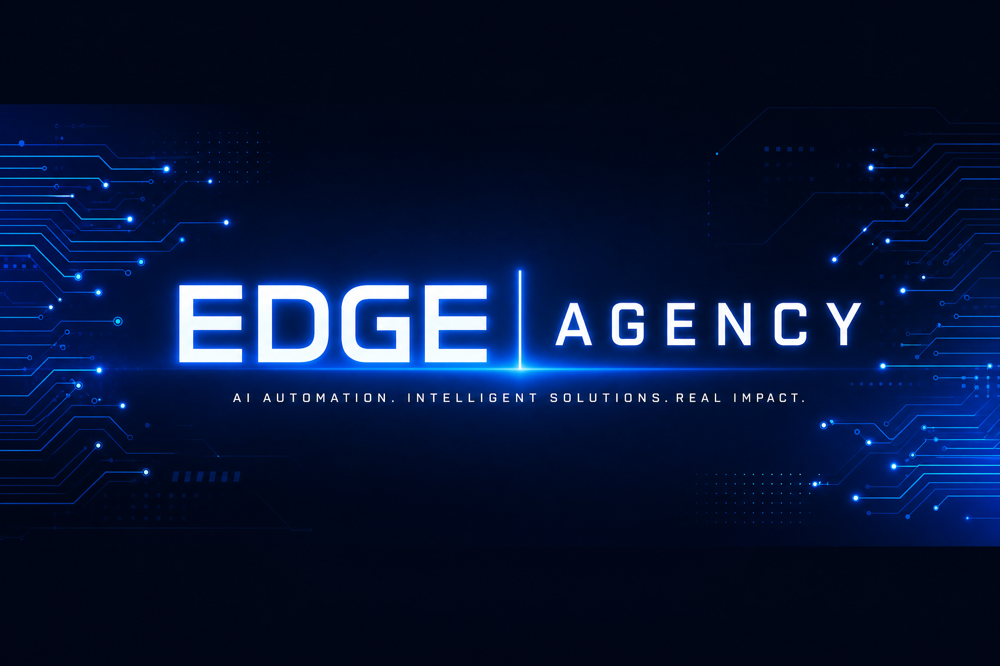

<div align="center">



# EdgeAgent

### Building practical AI systems for people who need control, portability, and real-world reliability.

I build tools at the intersection of **local LLMs, autonomous workflows, human oversight, automation, and spatial computing**.

[Explore the portfolio](#featured-work) · [View the project map](#portfolio-map) · [Visit Edge Agency](https://edgeagency.pro)

</div>

---

## Portfolio map

The work is organized around one question: **how do we make powerful software understandable and useful to the person responsible for the outcome?**

<div align="center">


</div>

## Featured work

These repositories and studio frameworks best represent the current portfolio.

| Project | What it explores | Status |
|---|---|---|
| **[Awesome Generative AI 1000](https://github.com/EdgeAgent/awesome-generative-ai-1000)** | A curated catalogue of 1,000 game-changing AI and software frameworks organized for the future of generative AI. | Open collection |
| **[EDGE Agency Automation Portfolio](https://github.com/EdgeAgent/edge-automation-portfolio)** | A portfolio of 73+ n8n workflows covering lead generation, real estate, e-commerce, content, customer service, and integrations. | Open portfolio |
| **[EDGE Agency AI Governance](https://github.com/EdgeAgent/EDGE-AGENCY-AI-Governance)** | Practical governance materials for building AI systems with clearer boundaries, review paths, and operational accountability. | Open framework |
| **[n8n Automations](https://github.com/EdgeAgent/n8n-automations)** | A public automation workspace for reusable workflow experiments and integrations. | Public workspace |
| **[RELAY — Agent Swarm Protocol](https://github.com/EdgeAgent/relay-protocol)** | A compact, versioned message dialect for fast, safe communication between specialist agents inside n8n. | Design-ready framework |
| **[DSER Agent Framework](https://github.com/EdgeAgent/dser-agent-framework)** | A provenance-aware agent framework that reconciles current evidence, retrieved memory, and trusted verification before action. | Public framework |},{find:
| **[Multi-Agent Orchestration](https://github.com/EdgeAgent/multi-agent-orchestration)** | Next-generation architecture specification, protocol stacks (MCP/ACP/A2A), and production blueprints for deterministic agent networks. | Production blueprint |
| **[Foundation Agent Architecture](https://github.com/EdgeAgent/foundation-agent-architecture)** | Engineering implementation of brain-inspired modular AI agents based on 2025 research from Stanford, DeepMind, and Yale. | Research blueprint |
| **[Real Estate AI Agent Framework](https://github.com/EdgeAgent/real-estate-agent-framework)** | Multi-agent orchestration for autonomous commercial due diligence, property analysis, and institutional risk modeling. | Industry blueprint |
| **[Edge Capital Crypto TradeBot](https://github.com/EdgeAgent/_EDGE-CAPITAL-CRYPTO_tradeBOT-8648)** | Institutional-grade algorithmic trading engine for high-frequency execution and advanced risk management. | Trading engine |
| **[TradeOS](https://github.com/EdgeAgent/TradeOS)** | Autonomous trading and asset allocation operating system powered by multi-agent risk models. | Public platform |
| **[EliteLeads](https://github.com/EdgeAgent/EliteLeads)** | AI-driven lead generation, multi-channel enrichment, and smart qualification engine. | Public portfolio |
| **[Nexus Prime](https://github.com/EdgeAgent/nexus-prime)** | Enterprise-grade node automation platform with visual workflow builders and secure execution. | Public framework |
| **[AI Voice Calling Agent](https://github.com/EdgeAgent/ai-voice-calling-agent-)** | Real-time conversational voice agent for customer service and high-consequence calling. | Public application |
| **[CallScheduler](https://github.com/EdgeAgent/CallScheduler)** | Intelligent scheduling, automated calendar routing, and CRM synchronization agent. | Public utility |

## Featured studio builds

All studio builds and frameworks are fully open-source and live. **[ModelDock USB](https://github.com/EdgeAgent/modeldock-usb)** is a local LLM command center for inspectable business workflows, approval gates, audit logs, recovery controls, and portable execution. **[TraceForge](https://github.com/EdgeAgent/traceforge)** is an auditable AI framework for Ontario industrial sectors, with structured inference, confidence thresholds, human review, and traceable decisions.

## Featured project: ModelDock USB

[](https://github.com/EdgeAgent/modeldock-usb)

**ModelDock USB** is a local LLM command center for autonomous business workflows—with humans in control. It turns plain-language requests into inspectable workflows, routes work through specialist agents, pauses for approval when risk matters, and preserves an operational audit trail.


| Built for | What it provides |
|---|---|
| **Local-first operators** | Offline execution, USB-local JSON persistence, loopback model health checks |
| **Cross-platform workflows** | Windows, macOS, and Linux launchers with USB-root-relative paths |
| **Human oversight** | Approval gates, audit logs, pause/resume, retries, timeouts, and emergency stop |
| **Model operators** | Platform-aware model discovery, read-only file scanning, and local setup validation |

### Why it matters

Most agent demos optimize for a successful answer. ModelDock optimizes for the operating loop around the answer: **start safely, inspect progress, review sensitive actions, recover from failure, and keep control**.

### Start here

```bash
git clone https://github.com/EdgeAgent/modeldock-usb.git
cd modeldock-usb
pnpm install
pnpm check
pnpm test
pnpm dev
```

→ **[Read the ModelDock USB README](https://github.com/EdgeAgent/modeldock-usb#readme)**

## Featured specification: Multi-Agent Orchestration

[](https://github.com/EdgeAgent/multi-agent-orchestration)

**Multi-Agent Orchestration** is a technical blueprint for moving beyond chaotic LLM chat rooms into structured, protocol-driven software architectures. It codifies the transition from unconstrained peer topologies to deterministic, fault-tolerant agent networks using asymmetric model routing and standardized protocol stacks.


| Architecture Pillar | What it provides |
|---|---|
| **Standardized Protocols** | Implementation of MCP, ACP, A2A, and ANP for seamless, cross-vendor agent communication. |
| **Work-as-Git Workspaces** | Local-first, file-backed state management using `~/.openalice` for absolute auditability. |
| **Deterministic Control** | Six production topologies (Supervisor, Debate, Pipeline) with explicit human approval gates. |
| **Quantitative Risk** | Pre-dispatch token cost estimation and rigorous position-sizing risk models for trading. |

### Why it matters

Unstructured agent groups suffer from 15x token inflation and 100% cascade failure rates. This specification provides the engineering guardrails required to deploy autonomous agents that are fast, predictable, and safe.

→ **[Read the Multi-Agent Orchestration Specification](https://github.com/EdgeAgent/multi-agent-orchestration#readme)**

## Featured industry solution: Real Estate AI Agent Framework (RE-AAF)

[](https://github.com/EdgeAgent/real-estate-agent-framework)

**Real Estate AI Agent Framework (RE-AAF)** is a production-grade multi-agent architecture that automates the 9 pillars of commercial due diligence. It transforms static manual checklists into an autonomous, verifiable analysis loop that moves from weeks of research to hours of execution.


| Operational Pillar | AI Agent Implementation |
|---|---|
| **Financial Audit** | Autonomous DSCR calculation, cash flow projection, and stress testing. |
| **Geospatial Intelligence** | Multi-channel analysis of foot traffic, competitor density, and infrastructure. |
| **Compliance & Physicals** | Automated zoning law review, ADA compliance scanning, and maintenance auditing. |
| **Deal Optimization** | Risk-adjusted bid generation based on historical sales and property history. |

### Why it matters

Institutional real estate acquisition requires absolute precision across multiple domains. RE-AAF provides the modular framework to scale due diligence with institutional rigor and 95% efficiency gains.

→ **[Read the Real Estate AI Agent Framework Blueprint](https://github.com/EdgeAgent/real-estate-agent-framework#readme)**

## Featured research: Foundation Agent Architecture (FAA)

[](https://github.com/EdgeAgent/foundation-agent-architecture)

**Foundation Agent Architecture (FAA)** translates the landmark 264-page survey by researchers from **Stanford, Yale, and Google DeepMind** into a practical engineering blueprint. It moves beyond isolated LLMs toward modular, brain-inspired systems that map cognitive, perceptual, and action modules to biological neural regions.


| Cognitive Pillar | Engineering Implementation |
|---|---|
| **Modular Brain Mapping** | Planning (Prefrontal Cortex), Perception (Sensory Cortices), and Action (Motor Cortex). |
| **Memory Lifecycle** | Hippocampus-inspired importance-weighted storage and Ebbinghaus-style temporal decay. |
| **ORPA Execution Loop** | Continuous cycle of Observation, Reflection, Planning, and Action for proactive deliberation. |
| **Bounded Autonomy** | Hard-coded Deontic Principles (Rules of Engagement) for ethical and safe agent execution. |

### Why it matters

Chatbots optimize for answers; Foundation Agents optimize for the operating loop. This architecture provides the theoretical and practical foundation for building agents that learn, adapt, and operate safely at scale.

→ **[Read the Foundation Agent Architecture Blueprint](https://github.com/EdgeAgent/foundation-agent-architecture#readme)**

## Featured framework: RELAY

[](https://github.com/EdgeAgent/relay-protocol)

**RELAY** is a compact communication layer for an internal agent swarm. It is designed for the place where broad interoperability standards are not the bottleneck: one operator’s own n8n workflows, where messages need to be fast, inexpensive, versioned, and easy to audit.

The protocol uses a fixed positional envelope—`v|FROM|TO|INTENT|REF|PAYLOAD`—with a shared codebook for agent roles, intents, stages, and task types. Instead of repeating verbose JSON keys, agents exchange compact payloads such as `L:4471,S:82,ACT:CALL`. **HERALD** translates the wire format into readable logs and dashboards, while unknown codes fail safely through `ESC` and human review.


| Protocol principle | What it provides |
|---|---|
| **Fixed envelope** | Predictable parsing with minimal repeated tokens across every message. |
| **Live codebook** | Versioned n8n Data Table shared by every agent and workflow. |
| **Compact payloads** | Short key-value pairs and enums for lead, task, and workflow state. |
| **Human translation** | HERALD turns compact messages into readable operational records. |
| **Safe fallback** | Unsupported versions or intents emit `ESC` rather than guessing. |

### Example message

```text
1|SC|CP|REQ|482|L:4471,S:82,ACT:CALL
```

→ **SCOUT** requests **COLDPEN** to act on lead `4471`, scored at `82%`, with a follow-up call as the next action.

### Why it matters

RELAY does not try to replace cross-vendor standards such as A2A. It occupies a narrower, practical layer: a cheap and predictable internal dialect for a known swarm, with a translation and escalation boundary that keeps the system understandable to its operator.

## What I am focused on

I am exploring how local models and agentic systems can become dependable operating tools rather than isolated demos. The work is centered on portable execution, transparent state, safety boundaries, and interfaces that make autonomy understandable to the person responsible for the outcome.

| Principle | Meaning in practice |
|---|---|
| **Local when possible** | Keep sensitive workflows close to the operator and make cloud use explicit. |
| **Human at the boundary** | Automation can prepare and coordinate; people decide when consequences matter. |
| **Inspectable by default** | Every meaningful action should have a status, a reason, and an audit trail. |
| **Portable by design** | A useful tool should not depend on one machine, one vendor, or one fragile setup. |
| **Honest about readiness** | Host validation, failure recovery, and security work matter more than a polished demo. |

## Connect with the work

Start with the public **[Visionary3D Studio](https://github.com/EdgeAgent/visionary3d-studio)**, explore the spatial work in **[SPLATwalk](https://github.com/EdgeAgent/SPLATwalk)**, or browse the automation catalogue in **[EDGE Agency Automation Portfolio](https://github.com/EdgeAgent/edge-automation-portfolio)**. Issues and pull requests are welcome when they improve operator control, reproducibility, accessibility, security, or cross-platform reliability.

<div align="center">

**Local models. Human oversight. Portable operations.**

</div>

## References

[1]: https://github.com/EdgeAgent/modeldock-usb "ModelDock USB repository"
[2]: https://docs.github.com/en/account-and-profile/setting-up-and-managing-your-github-profile/customizing-your-github-profile/about-your-profile-readme "GitHub profile README documentation"
